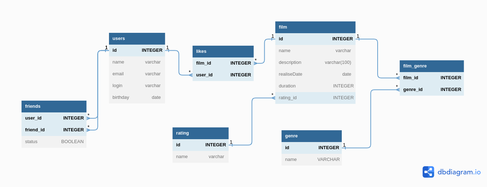

# java-filmorate
___
_by Ruslan Rodionov_

___
___
Бэкенд для сервиса, который будет работать пользователями, их друзьями,
с фильмами и оценками пользователей, а также возвращать ТОП фильмов, 
рекомендованных к просмотру. 

### Что может это приложение:
* добавление фильма
* добавление пользователя
* получение фильма по id
* получение пользователя по id
* получение всех пользователей
* получение всех фильмов
* добавление/удаление пользователя в друзья
* добавление/удаление лайка фильму от пользователя
* получение ТОП фильмов
* возрастной рейтинг фильма
* жанр фильма

---
## Схема базы данных для работы приложения

  

### SQL для быстрого старта:  
* ####  [Сборка БД](src/main/resources/schema.sql)
* ####  [Заполнение БД тестовыми данными](src/main/resources/not_data.sql)
* ####  [Основные запросы](sql/filmorateDB/BaseQerys.sql)
  
___
###### Practicum homework project.
#### [Яндекс-Практикум](https://practicum.yandex.ru/java-developer/)