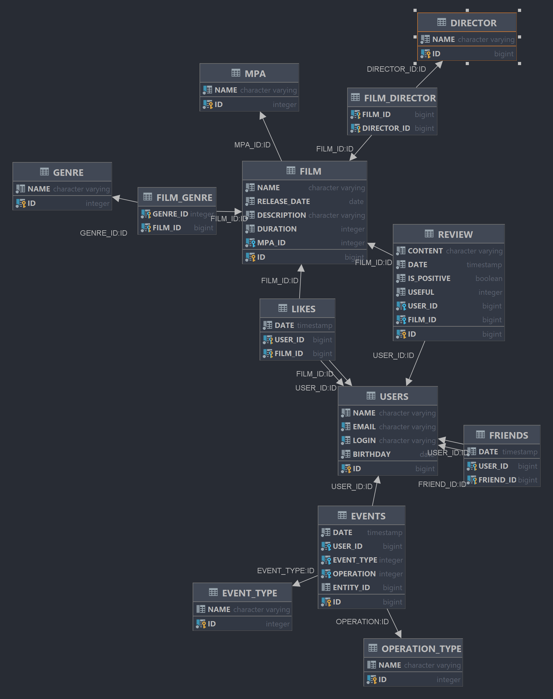

# java-filmorate
___
_by Ruslan Rodionov_

___
___
Бэкенд для сервиса, который будет работать пользователями, их друзьями,
с фильмами и оценками пользователей, а также возвращать ТОП фильмов, 
рекомендованных к просмотру. 

### Что может это приложение:
* добавление фильма
* добавление пользователя
* получение фильма по id
* получение пользователя по id
* получение всех пользователей
* получение всех фильмов
* добавление/удаление пользователя в друзья
* добавление/удаление лайка фильму от пользователя
* получение ТОП фильмов
* возрастной рейтинг фильма
* жанр фильма

---
## Схема базы данных для работы приложения

  

Наше приложение выполняет ряд функций таких как:
==
- ### Оценка фильма для составления рейтинга;
- ### Писать отзывы к фильмам;
- ### Получение рейтинга популярных фильмов;
- ### Получение фильмов по режиссерам;
- ### Поиск фильмов;
- ### Получение общих фильмов друзей;
- ### Добавление пользователей в друзья;
- ### Получение рекомендованных пользователю фильмов по оценкам;
- ### Просматривать ленту событий пользователя.

Над групповым проектом 12 спринта работали:
===
>### Руслан Родионов! Он же тимлид нашей команды! 
> #### На его плечи легли такие задачи как:

 - #### 1.Функциональность "Удаление фильмов и пользователей".
 - #### 2.Функциональность "Поиск".
 - #### 3.Внутри-групповую кухню.

>### Паша Чен! Он же ЗамТимлида!
> #### Его испытали такие задачи как:
 - ##### 1.Структура "Реорганизация БД".
 - ##### 2.Функциональность "Фильмы по режиссёрам".

>### Дмитрий Панфилов! Самый спокойный человек из нашей группы!
> #### Ему выпали рандомные задачи такие как:
-  ##### 1.Функциональность «Общие фильмы».
-  ##### 2.Функциональность "Популярные фильмы".

>### Иван Цветков! Паникер!
> #### Захотел отзывы, получай отзывы:
- ##### 1.Функциональность «Отзывы».

>### Серафим Уханов!Скрытнось 100!
> #### Совсем непростая задача:
-  ##### 1.Функциональность «Лента событий».

>### Максим Шевченко! Взял и сделал!
> ##### Задача на выносливость:
- ##### 1.Функциональность «Рекомендации».

### SQL для быстрого старта:  
* ####  [Сборка БД](src/main/resources/schema.sql)
* ####  [Заполнение БД тестовыми данными](src/main/resources/not_data.sql)
* ####  [Основные запросы](sql/filmorateDB/BaseQerys.sql)
  
___
###### Practicum homework project.
#### [Яндекс-Практикум](https://practicum.yandex.ru/java-developer/)